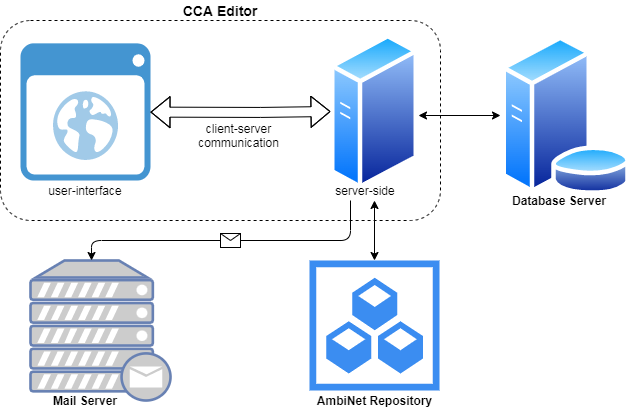
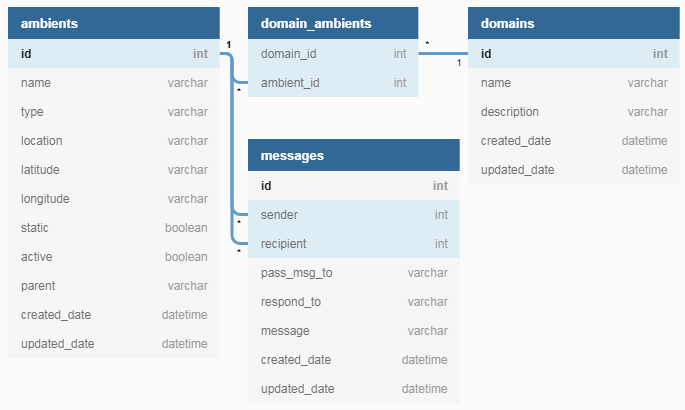

# A Calculus of Context-Aware Systems Editor

A new generation editor for modelling Context-Aware Systems (Development Environment)

## Getting Started

These instructions will get you a copy of the project up and running on your local machine for development and testing purposes.

### You Need

1. To install on your local machine Java JDK 1.8 or greater.
2. To install Java Development Environment (IDE) - Eclipse IDE or IntelliJ IDEA (no required versions).
3. To install Maven (no required version) on your local machine, but it's not required to run the application.

### Project Set Up

1. Pull the source code from the GitHub Repository.
2. Import it to the IDE (Eclipse IDE or IntelliJ IDEA).
3. Configure your build path and where your local Java is located.
4. This is a Maven project. So, run maven clean and/or maven build if it's neccessary.
5. All project configurations are part from the repository in GitHub except the credentials for email sending functionality, because of the security reasons.
6. Ask other team member to give you the `email_config.json` file. If you don't have the file, it will be created automatically, when you try to use `Contact Us` form, but it will be empty and should not be able to send an email.
7. Once you have the file, you need to place it into the following folder: `src/main/resources/`
8. The email configurations file has the following format (this is example data)

```json
{
	"senderEmail":"test_sender_email@example.com",
	"senderEmailPass":"TestPassword",
	"recipientEmail":"test_recipient_email@example.com",
	"recipientBccEmail":"test_bcc_recipient_email@example.com",
	"smtpServerHost":"mail.server",
	"smtpServerTls":"true/false",
	"smtpServerAuth":"true/false",
	"smtpServerPort":"80"
}
```
9. Now, you can try to run the application. If you have any other issues that are not described here, please contact the other team members.

### Project Start Up
It is possible to start the *CCA Editor* application in different modes that are described below. Currently, two different modes are supported (_smart city and smart agriculture_).

* If you start the application without any program arguments, it will start in default *smart city* mode.
* If you start the application with program argument equals to 0, it will start in *smart city* mode.
* If you start the application with program argument equals to 1, it will start in *smart agriculture* mode.
* If you start the application with program argument different than 0 or 1, it will be treated as an invalid application mode and the application will start in default *smart city* mode.

You can set the program arguments on application start at least in three different ways. The *CCA Editor* application can accept any number of arguments. This allows the developer/user to specify configuration information, when the application is launched.
* [Command-Line](https://docs.oracle.com/javase/tutorial/essential/environment/cmdLineArgs.html)
* [Eclipse IDE](https://www.cs.colostate.edu/helpdocs/cmd.pdf)
* [IntelliJ IDEA](https://www.jetbrains.com/help/idea/running-applications.html)

## High-Level Application Architecture
High-level architectural diagram of the *CCA Editor* application is provided below. It contains four main elements: *CCA Editor (user-interface and server-side)*, *Database Server*, *Mail Server* and *AmbiNet Repository*.



## High-Level Application Database Diagram

High-level database diagram of the *CCA Editor* application is provided below. It contains four main database tables with relations between them: *domains*, *domain_ambients*, *ambients* and *messages*. The relationship between the ambients and domains is *Many-To-Many*, and that's the reason why we have a separate helper table (*domain_ambients*). On the other hand, the relationship between the ambients and messages is *One-To-Many*.



## Used Technologies

* [Java 8](https://www.oracle.com/java/technologies/java8.html)
* [Java Swing/AWT](https://docs.oracle.com/javase/tutorial/uiswing/)
* [Java Mail API 1.6.2](https://javadoc.io/doc/javax.mail/javax.mail-api/latest/index.html)
* [Logback 1.2.3](http://logback.qos.ch/)
* [SLF4J 1.7.30](http://www.slf4j.org/)
* [OpenCSV 5.3](http://opencsv.sourceforge.net)
* [Jackson 2.12.2](https://en.wikipedia.org/wiki/Jackson_(API))
* [JFree Chart 1.0.13](https://www.jfree.org/jfreechart/)
* [JUnit 4.13.1](https://junit.org/junit4)
* [Maven](https://maven.apache.org/)
* [Eclipse](https://www.eclipse.org/)
* [SonarLint](https://www.sonarlint.org/)
* [PostgreSQL Database](https://www.postgresql.org/)
* CCA paradigm
* ccaPL language
* CCA Parser
* CCA Animator

## Resources

* [Images](https://freeicons.io)
* [Icons](https://www.flaticon.com)

## Java Doc

You can view full Java [documentation](doc/index.html) for all classes and interfaces for this application.

`./<project_folder>/doc/index.html`

You can update Java documentation from Eclipse: `Project -> Generate javadoc...`

Reference: [here](https://stackoverflow.com/questions/4468669/how-to-generate-javadoc-html-files-in-eclipse)

## Sample output of the CCA Parser from a scenario into the console

```java
--->  {Sibling to sibling: Plovdiv_University ===(Are_you_working)===> Pharmacy}
--->  {Sibling to sibling: Pharmacy ===(Are_you_working,Yes)===> Plovdiv_University}
--->  {Sibling to sibling: Plovdiv_University ===(Do_you_have_a_coffee)===> Coffee_Shop}
--->  {Sibling to sibling: Coffee_Shop ===(Do_you_have_a_coffee,Yes_of_course)===> Plovdiv_University}
--->  {Sibling to sibling: Plovdiv_University ===(Do_you_have_notebooks)===> Bookstore}
--->  {Sibling to sibling: Bookstore ===(Do_you_have_notebooks,Yes_I_have_only_one)===> Plovdiv_University}
```
